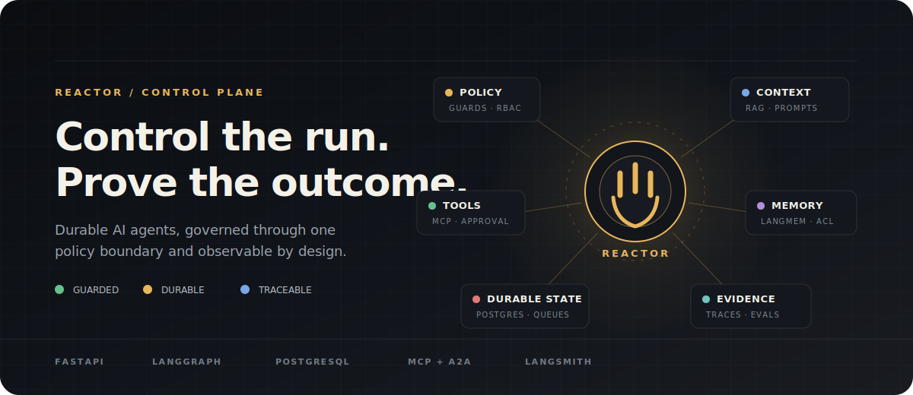
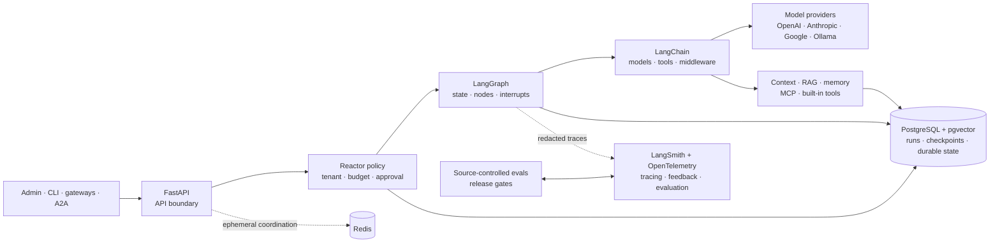

<div align="center">
  

  <p>
    <a href="#quick-start"><strong>Quick start</strong></a> ·
    <a href="#platform">Platform</a> ·
    <a href="#operator-console">Operator console</a> ·
    <a href="#architecture">Architecture</a> ·
    <a href="docs/architecture/python-langgraph-replatform-spec.md">Specification</a> ·
    <a href="SECURITY.md">Security</a>
  </p>

  <p>
    
    
    
    
    
    
  </p>
</div>

Reactor is an Apache-2.0-licensed enterprise AI agent platform being prepared
for public release. It combines a durable LangGraph runtime, a deterministic
FastAPI policy boundary, and an operator console in one Python-first system.

**Give every user a personal agent workspace. Keep every run, tool, memory,
approval, integration, and dollar under explicit organizational control.**

> [!IMPORTANT]
> Reactor is under active development. Local mode is intentionally convenient
> and non-durable. Production and `database_required` deployments fail closed
> when PostgreSQL is unavailable.

## Quick Start

Start the API without provider keys, PostgreSQL, or Redis:

```bash
uv sync --frozen
uv run uvicorn reactor.api.app:create_app \
  --factory --host 127.0.0.1 --port 8000
```

Create a run:

```bash
curl -X POST http://127.0.0.1:8000/v1/runs \
  -H 'content-type: application/json' \
  -d '{"message":"Explain what Reactor controls in three bullets."}'
```

Open the API at `http://127.0.0.1:8000/docs`, or start the operator console:

```bash
pnpm --dir apps/admin install --frozen-lockfile
pnpm --dir apps/admin dev
```

The console runs at `http://127.0.0.1:3001` and proxies the local API. For the
database-free quick start, use the development-only **Demo login** action. Its
users, token revocations, and generated signing secret are process-local and are
discarded when the API stops. The demo endpoint is unavailable outside the
`local` environment.

For the complete PostgreSQL/pgvector and Redis stack:

```bash
docker compose up --build app admin db redis
```

<details>
<summary><strong>Prerequisites and model providers</strong></summary>

### Prerequisites

- Python 3.13.14
- [`uv`](https://docs.astral.sh/uv/)
- Node.js and `pnpm` for the operator console
- Docker for the complete local stack

Cloud provider keys are optional in local development. Configure only the
providers you intend to use in `.env`:

```dotenv
OPENAI_API_KEY=
ANTHROPIC_API_KEY=
GOOGLE_API_KEY=
```

Ollama uses the same LangChain provider boundary without a cloud key:

```bash
ollama run gemma4:12b
uv run reactor-live-provider-smoke \
  --provider ollama \
  --model gemma4:12b \
  --output reports/release/local-ollama-provider-smoke.json
```

</details>

## Platform

| | |
| --- | --- |
| **Deterministic control**<br />Tool access, approvals, budgets, timeouts, loop exit, and tenancy are enforced in code. | **Durable execution**<br />Runs, checkpoints, queues, leases, retries, outbox/inbox records, and idempotency live in PostgreSQL. |
| **Grounded intelligence**<br />RAG and memory preserve tenant, ACL, source, citation, and content-integrity evidence. | **Human control**<br />Risky actions pause through LangGraph interrupts backed by durable approval records. |
| **Open interoperability**<br />MCP connects model-facing tools. A2A connects external agent systems without becoming the internal runtime. | **Operational evidence**<br />LangSmith, OpenTelemetry, metrics, evals, and release gates expose what the system actually proved. |

Reactor prefers framework-native capabilities from LangGraph, LangChain,
FastAPI, Pydantic, SQLAlchemy, MCP, A2A, and LangMem. Custom code stays at the
product boundary: policy, RBAC, tenancy, audit, retention, cost, and safe
compatibility.

## Operator Console

Reactor includes a React-based web console in [`apps/admin`](apps/admin). It is
the operational surface for the same FastAPI control plane—not a second backend
and never a shortcut around Reactor policy.

| Workspace | What operators can do |
| --- | --- |
| **Observe** | Review dashboards, sessions, traces, chat execution, feedback, usage, performance, health, and ingestion signals. |
| **Govern** | Handle approvals, safety rules, tool policy, access control, tenants, runtime settings, retention, and audit logs. |
| **Build** | Manage prompts, personas, model registrations, MCP servers, documents, RAG caches, schedules, and integrations. |
| **Release** | Inspect issues, eval results, provider and protocol readiness, and machine-readable release-gate evidence. |

Routes are capability-aware and role-aware. The browser asks the API which
features and actions are available, while the backend remains authoritative for
authentication, authorization, tenant scope, validation, and durable writes.
The shared client attaches the active bearer token or Reactor API key, normalizes
API errors, and retries only bounded transient failures.

```bash
# Development server at http://127.0.0.1:3001
pnpm --dir apps/admin install --frozen-lockfile
pnpm --dir apps/admin dev

# Focused console verification
pnpm --dir apps/admin lint
pnpm --dir apps/admin build
pnpm --dir apps/admin test
pnpm --dir apps/admin verify:admin-api
```

See the [admin console guide](apps/admin/README.md) for proxy configuration,
browser tests, live-stack verification, deployment, and frontend conventions.

## Architecture



LangGraph, LangChain, and LangSmith are complementary layers, not interchangeable
runtimes:

| Layer | What it owns in Reactor |
| --- | --- |
| **Reactor** | Product policy: tenancy, RBAC, budgets, approvals, audit, idempotency, retention, redaction, and release evidence. |
| **LangGraph** | Execution control: versioned state, node and subgraph order, streaming, interrupts, bounded loops, checkpointing, fork, and replay. |
| **LangChain** | Model-facing integration: messages, provider adapters, tool calling, middleware, structured output, retrieval interfaces, fallback, and usage metadata. |
| **LangSmith** | Operational learning: redacted traces, offline experiments, online feedback, latency and cost analysis, and regression-dataset workflows. |

A run enters through FastAPI, where Reactor authenticates the caller and resolves
trusted policy. LangGraph then controls **when** each step executes and persists
recoverable state. Inside those steps, LangChain standardizes **how** models,
tools, middleware, retrievers, and structured responses are invoked. LangSmith
observes the resulting execution and supports evaluation, but it is neither the
runtime nor the durable source of truth.

PostgreSQL owns runs, checkpoints, queues, approvals, memories, vectors, audit,
and idempotency. Redis is limited to ephemeral locks, counters, cache, Pub/Sub
wakeups, and multi-replica coordination. Source-controlled eval suites and Reactor
release gates remain authoritative even when datasets and experiment results are
synced to LangSmith.

### Non-negotiable contracts

- Guards fail closed. Hooks fail open except for cancellation.
- Production graph execution is asynchronous, bounded, and checkpointed.
- Tenant and ACL filters run before retrieval ranking and limits.
- Tool output is untrusted until sanitized and labeled.
- Risky or externally visible actions require approval or explicit sandbox policy.
- Secrets, private payloads, and raw authorization metadata stay out of public
  APIs, model context, logs, and traces.
- Redis never becomes durable agent state.

Read the
[canonical architecture specification](docs/architecture/python-langgraph-replatform-spec.md)
and [agent harness operating model](docs/architecture/agent-harness-operating-model.md)
for the complete contracts.

<details>
<summary><strong>How a run moves through Reactor</strong></summary>

1. FastAPI authenticates the caller and projects trusted tenant, user, thread,
   and run metadata.
2. Reactor resolves graph, middleware, model, context, and tool-profile policy.
3. LangGraph executes guarded nodes or framework-native agent middleware with a
   positive recursion limit.
4. Tool calls pass schema, risk, approval, idempotency, timeout, audit, and output
   sanitization boundaries.
5. Checkpoints, usage, artifacts, citations, and durable side effects are written
   through application-owned stores.
6. Public responses expose allowlisted metadata; operators receive redacted
   traces and machine-readable release evidence.

</details>

<details>
<summary><strong>Repository map</strong></summary>

```text
reactor/
├── src/reactor/
│   ├── api/              FastAPI routers, DTOs, and streaming
│   ├── agents/           LangGraph state, graphs, nodes, and policy
│   ├── context/          Context manifests, budgets, and prompt inputs
│   ├── tools/            Tool contracts, MCP, risk policy, and audit
│   ├── rag/              Ingestion, retrieval, ACLs, and citations
│   ├── memory/           Memory lifecycle and LangMem integration
│   ├── jobs/             Queues, leases, retries, outbox, and inbox
│   ├── persistence/      SQLAlchemy models and repositories
│   ├── observability/    Logs, metrics, tracing, and redaction
│   └── evals/            Datasets, graders, and release gates
├── apps/admin/           React operator and developer console
├── migrations/           Alembic migrations
├── evals/                Source-controlled evaluation suites
├── reports/              Machine-readable verification evidence
├── scripts/              Development, migration, and release tools
└── docs/                 Architecture and operating documentation
```

</details>

## Verification

Reactor treats tests, static checks, smokes, and release artifacts as executable
evidence—not as optional CI decoration.

```bash
# Backend
uv lock --check
uv run ruff check
uv run ruff format --check
uv run pyright
uv run pytest
uv run python scripts/dev/smoke-health.py

# Operator console
pnpm --dir apps/admin lint
pnpm --dir apps/admin build
pnpm --dir apps/admin test
pnpm --dir apps/admin verify:admin-api

# Runtime contract evidence
uv run reactor-hardening-suite \
  --report-file reports/hardening-suite.json
```

Some integration and live-provider lanes require PostgreSQL, Redis, Docker, or
provider credentials. Release aggregation distinguishes passed, failed, and
skipped gates and fails closed when required evidence is absent or malformed.

## Documentation

| Start here | What it owns |
| --- | --- |
| [Architecture specification](docs/architecture/python-langgraph-replatform-spec.md) | Product, runtime, storage, security, and module decisions |
| [Agent harness operating model](docs/architecture/agent-harness-operating-model.md) | Repository rules, feedback sensors, and release evidence |
| [Admin console guide](apps/admin/README.md) | Web development, testing, and deployment |
| [Migration runbook](docs/migration/cutover-rollback-runbook.md) | Import, parity, cutover, rollback, and rehearsal |
| [Security policy](SECURITY.md) | Private reporting and response process |
| [Contributing guide](CONTRIBUTING.md) | Setup, invariants, tests, and pull requests |

## Security

Do not report vulnerabilities in a public issue. Follow [SECURITY.md](SECURITY.md)
and include only redacted logs or traces.

Never commit provider keys, Slack or MCP credentials, signing secrets, tenant
exports, production prompts, raw traces, or private tool payloads. Example
configuration contains placeholders only.

## Project Provenance

This is the standalone personal Reactor repository maintained at
[`wlsdks/reactor`](https://github.com/wlsdks/reactor). It was initialized from a
reviewed source snapshot at root commit
`c5367374f8965bdf1b2c8b7179ef43ef2130ac00`.

No branch, tag, parent commit, or Git object from the former private source
repositories was imported. Those repositories remain separate restricted
archives and are not development remotes for this project. Public release still
depends on the current-candidate checks in
[`docs/security/public-release-audit.md`](docs/security/public-release-audit.md).

## License

Reactor is available under the [Apache License 2.0](LICENSE).
